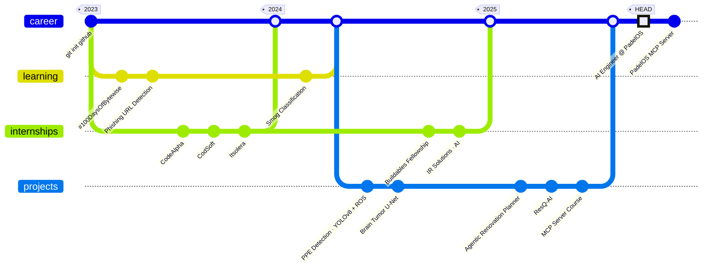

<!-- ════════════════════════════════  HEADER  ════════════════════════════════ -->


<div align="center">


</div>

<p align="center"><a href="https://www.linkedin.com/in/ahmed-islam01"></a>&nbsp;<a href="https://ahmedislam.netlify.app/"></a>&nbsp;<a href="mailto:ahmedislam.official@gmail.com"></a>&nbsp;<a href="https://www.kaggle.com/ahmedislam0"></a>&nbsp;<a href="https://github.com/Ahmed-Islam-AI?tab=followers"></a></p>

<!-- ════════════════════════════════  MANIFEST  ════════════════════════════════ -->

## 📄 `ahmed.yaml`

```yaml
apiVersion: engineer/v1
kind: AIEngineer
metadata:
  name: ahmed-islam
  location: Islamabad, Pakistan 🇵🇰
  labels:
    role: ai-engineer
    company: padelos
    founder: mindmatrix
spec:
  focus: [agentic-ai, llm-systems, mcp, computer-vision]
  stack:
    agents:   [langgraph, langchain, google-adk, n8n]
    models:   [claude, gpt, gemini, llama]
    ml:       [pytorch, tensorflow, yolo, u-net]
    backend:  [fastapi, flask, django]
  certifications: [ibm-machine-learning]
status:
  building: padelos-mcp-server
  learning: [langgraph, n8n, agentic-ai]
  askMeAbout: [ai, machine-learning, data-science, agentic-ai, linkedin-growth, personal-branding]
```

> [!TIP]
> **Open to collaboration** on agentic AI, MCP tooling and LLM projects — the fastest way to reach me is [LinkedIn](https://www.linkedin.com/in/ahmed-islam01).

<!-- ════════════════════════════════  JOURNEY  ════════════════════════════════ -->

## 🧭 `git log --graph career`



<!-- ════════════════════════════════  CREDENTIALS  ════════════════════════════════ -->

## 🏅 Credentials & Programs

<p align="center">&nbsp;&nbsp;&nbsp;</p>
<!-- ════════════════════════════════  PROJECTS  ════════════════════════════════ -->

## 🚀 Selected Work

<div align="center">
  
  <a href="https://flintgrab.com/"></a>
  
  <a href="https://github.com/Ahmed-Islam-AI/Agentic-AI-Home-Renovation-Planner"></a>
  <a href="https://github.com/Ahmed-Islam-AI/PPE-Detection-for-Construction-site-workers"></a>
  <a href="https://github.com/modelcontextprotocol/inspector/pull/1258"></a>
  <br/>
  <a href="https://github.com/Ahmed-Islam-AI/Brain-Tumor-Segmentation-using-U-Net"></a>
  <a href="https://github.com/Ahmed-Islam-AI/ResQ-AI"></a>
  <a href="https://github.com/Ahmed-Islam-AI/MCP-server-creation-course"></a>
  <a href="https://github.com/Ahmed-Islam-AI?tab=repositories"></a>
</div>

<!-- ════════════════════════════════  STACK  ════════════════════════════════ -->

## 🪐 Tech Stack

<div align="center">
  
</div>

<!-- ════════════════════════════════  METRICS  ════════════════════════════════ -->

## 📡 GitHub Telemetry

<div align="center">
  
  
</div>

<br/>

<div align="center">
  <picture>
    <source media="(prefers-color-scheme: dark)" srcset="https://raw.githubusercontent.com/Ahmed-Islam-AI/Ahmed-Islam-AI/output/github-contribution-grid-snake-dark.svg" />
    
  </picture>
</div>


